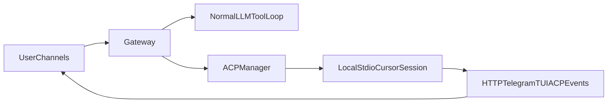

# Architecture Overview

GoClaw is a Go implementation of an AI agent gateway, designed to orchestrate LLM interactions with tool execution and multi-channel communication.

## High-Level Architecture

```
┌───────────────────────────────────────────────────────────────────────┐
│                             Channels                                   │
│  ┌────────┐ ┌────────┐ ┌────────┐ ┌──────────┐ ┌─────┐ ┌──────┐      │
│  │Telegram│ │WhatsApp│ │  HTTP  │ │HTTP Voice│ │ TUI │ │ Cron │      │
│  └───┬────┘ └───┬────┘ └───┬────┘ └────┬─────┘ └──┬──┘ └──┬───┘      │
│      │          │          │           │          │       │           │
└──────┼──────────┼──────────┼───────────┼──────────┼───────┼───────────┘
       │          │          │           │          │       │
       └──────────┴──────────┴─────┬─────┴──────────┴───────┘
                                   │
                                   ▼
                ┌───────────────────────────────┐
                │           Gateway             │
                │  ┌─────────────────────────┐  │
                │  │      Agent Loop         │  │
                │  │  ┌───────────────────┐  │  │
                │  │  │   LLM Registry    │  │  │
                │  │  │   (4 providers)   │  │  │
                │  │  └───────────────────┘  │  │
                │  │  ┌───────────────────┐  │  │
                │  │  │   Tool Registry   │  │  │
                │  │  └───────────────────┘  │  │
                │  └─────────────────────────┘  │
                │                               │
                │  ┌─────────────────────────┐  │
                │  │    Session Manager      │  │
                │  │  ┌───────────────────┐  │  │
                │  │  │ Compactor         │  │  │
                │  │  └───────────────────┘  │  │
                │  │  ┌───────────────────┐  │  │
                │  │  │ Checkpoint Gen    │  │  │
                │  │  └───────────────────┘  │  │
                │  └─────────────────────────┘  │
                │                               │
                │  ┌─────────────────────────┐  │
                │  │    Support Services     │  │
                │  │  • Prompt Cache         │  │
                │  │  • Skills Manager       │  │
                │  │  • Memory Manager       │  │
                │  │  • Memory Graph         │  │
                │  │  • Transcript Manager   │  │
                │  │  • Media Store          │  │
                │  │  • HASS Manager         │  │
                │  │  • STT Provider         │  │
                │  └─────────────────────────┘  │
                └───────────────────────────────┘
                            │
        ┌───────────────────┴───────────────────┐
        │                                       │
        ▼                                       ▼
┌───────────────────────┐         ┌───────────────────────────┐
│   Text Agent Loop     │         │    Voice Agent Loop       │
│   (LLM Registry)      │         │    (VoiceLLM Registry)    │
│                       │         │                           │
│  Channels: Telegram,  │         │  Channel: HTTP Voice only │
│  WhatsApp, HTTP, TUI, │         │                           │
│  Cron                 │         │  Per-session WebSocket    │
└───────────────────────┘         │  instances with audio I/O │
                                  └───────────────────────────┘
                            │
                            ▼
                ┌───────────────────────────┐
                │      Storage Layer        │
                │  ┌─────────────────────┐  │
                │  │       SQLite        │  │
                │  │  (sessions, trans-  │  │
                │  │   cripts, memory)   │  │
                │  └─────────────────────┘  │
                │  ┌─────────────────────┐  │
                │  │    JSONLReader      │  │
                │  │ (OpenClaw compat)   │  │
                │  └─────────────────────┘  │
                └───────────────────────────┘
```

---

## ACP Session Routing

GoClaw can route a text-session turn through one of two paths:

- the normal LLM-and-tools loop
- an attached ACP session managed by the ACP manager

ACP does not replace channels. Channels still talk to the gateway, and the gateway decides whether the current session is routed to the standard agent loop or to an attached ACP session.



In the current MVP, the ACP path is limited to the Cursor driver over local stdio. The ACP manager keeps session attachment state, tracks pending interactive requests, and exposes those events back to channels for HTTP cards, Telegram prompts or polls, and TUI notices.

---

## Core Components

### Gateway (`internal/gateway`)

The central orchestrator that:
- Receives requests from channels
- Manages the agent loop (LLM ↔ Tools)
- Handles session lifecycle
- Coordinates compaction and checkpoints
- Integrates with support services (skills, memory, media, HASS)

```go
type Gateway struct {
    sessions            *session.Manager
    users               *user.Registry
    llm                 llm.Provider          // Primary LLM provider
    registry            *llm.Registry         // Unified provider registry
    tools               *tools.Registry
    channels            map[string]Channel
    config              *config.Config
    checkpointGenerator *session.CheckpointGenerator
    compactor           *session.Compactor
    promptCache         *gcontext.PromptCache
    mediaStore          *media.MediaStore
    memoryManager       *memory.Manager
    commandHandler      *commands.Handler
    skillManager        *skills.Manager
    cronService         *cron.Service
    hassManager         *hass.Manager
}
```

### Session Manager (`internal/session`)

Manages conversation state:

| Component | Responsibility |
|-----------|---------------|
| `Manager` | Session lifecycle, storage coordination |
| `Session` | In-memory message buffer, token tracking |
| `Compactor` | Context overflow handling, LLM fallback |
| `CheckpointGenerator` | Rolling snapshot generation |
| `SQLiteStore` | Persistent storage (primary) |
| `JSONLReader` | Read-only OpenClaw session inheritance |
| `SessionWatcher` | Real-time sync with OpenClaw sessions |

### LLM Registry (`internal/llm`)

Unified provider management with fallback chains:

| Provider | Use Cases |
|----------|-----------|
| `AnthropicProvider` | Agent responses (Claude models), thinking/extended reasoning |
| `OpenAIProvider` | GPT models, OpenAI-compatible APIs (LM Studio, LocalAI) |
| `OllamaProvider` | Local inference, embeddings, summarization |
| `XAIProvider` | Grok models, stateful conversations |

The registry supports:
- **Purpose chains**: Different providers for agent, summarization, embeddings
- **Automatic fallback**: Try next provider on failure
- **Cooldown management**: Exponential backoff for failed providers
- **Stateful providers**: Session state persistence (e.g., xAI context)

### Context System (`internal/context`)

Handles workspace context and system prompt construction:

| Component | Responsibility |
|-----------|---------------|
| `PromptCache` | Caches workspace files, invalidates on change |
| `WorkspaceFile` | Represents identity files (SOUL.md, AGENTS.md, etc.) |

The PromptCache uses fsnotify for immediate file change detection with hash polling as fallback. Watched files include:
- `AGENTS.md`, `SOUL.md`, `TOOLS.md`, `IDENTITY.md`
- `USER.md`, `HEARTBEAT.md`, `BOOTSTRAP.md`, `MEMORY.md`

### Tool Registry (`internal/tools`)

Available agent tools (registered conditionally by config/feature flags):

| Tool | Description |
|------|-------------|
| `read` | Read file contents |
| `write` | Write file contents |
| `edit` | Edit file (string replace) |
| `exec` | Execute shell commands (sandboxed) |
| `jq` | JSON query/transformation |
| `message` | Send messages to channels |
| `media` | Inspect media storage usage and retention |
| `media_display` | Display images/media to user |
| `cron` | Schedule tasks |
| `subagent_spawn` | Spawn delegated subagent run |
| `subagent_status` | Inspect delegated run state |
| `subagent_cancel` | Cancel delegated run (optional cascade) |
| `subagent_fanout` | Bounded fanout + deterministic aggregation (+ optional synthesis) |
| `memory_graph_recall` | Retrieve memories from graph |
| `memory_graph_query` | Search/filter memory graph |
| `memory_graph_store` | Add memory to graph |
| `memory_graph_update` | Modify memory in graph |
| `memory_graph_forget` | Remove memory from graph |
| `memory_graph_search` | Legacy memory graph search (compat) |
| `memory_search` | Semantic search over memory files |
| `memory_get` | Fetch memory by ID |
| `transcript` | Search/query conversation history |
| `web_search` | Multi-provider web search (Brave/Grok/Perplexity/Gemini) |
| `web_fetch` | Fetch web page content |
| `browser` | Browser automation (Chromium) |
| `acp_control` | Attach, steer, cancel, detach, or close ACP sessions |
| `acp_inspect` | Inspect ACP attachment state, pending requests, and recent extensions |
| `hass` | Home Assistant control |
| `xai_imagine` | xAI image generation |
| `xai_video` | xAI video generation |
| `user_auth` | Role elevation requests |
| `skills` | Skill management and installation |
| `goclaw_update` | Self-update GoClaw |

### Channels

Communication interfaces:

| Channel | Package | Description |
|---------|---------|-------------|
| Telegram | `internal/channels/telegram` | Bot interface via telebot.v4 |
| WhatsApp | `internal/channels/whatsapp` | Linked device protocol via whatsmeow |
| HTTP | `internal/channels/http` | Web UI and REST API |
| HTTP Voice | `internal/channels/http_voice` | Real-time voice conversations via WebSocket |
| TUI | `internal/channels/tui` | Terminal UI via bubbletea |
| Cron | `internal/cron` | Scheduled task execution |

### HTTP Voice Channel & VoiceLLM

The HTTP Voice channel (`http_voice`) provides real-time voice conversations. Unlike text channels that use the main LLM Registry, voice uses a completely separate **VoiceLLM Registry** with its own provider interface.

```
                         ┌─────────────────────────┐
Browser ←──WebSocket──→  │   HTTP Voice Channel    │
           (PCM audio)   │                         │
                         │  ┌───────────────────┐  │
                         │  │ VoiceLLM Registry │  │
                         │  │ (per-session)     │  │
                         │  └─────────┬─────────┘  │
                         │            │            │
                         │            ▼            │
                         │  ┌───────────────────┐  │
                         │  │ VoiceLLM Provider │──┼──→ xAI/OpenAI WebSocket
                         │  │ (xAI, OpenAI)     │  │    (bidirectional audio)
                         │  └───────────────────┘  │
                         └─────────────────────────┘
```

**Key differences from Text LLM:**

| Aspect | Text LLM Registry | VoiceLLM Registry |
|--------|-------------------|-------------------|
| Providers | Shared instances | Per-session instances |
| Connection | HTTP request/response | Persistent WebSocket |
| I/O | Text messages | Streaming audio |
| Tool calls | Via agent loop | Via callbacks |
| Channels | All text channels | HTTP Voice only |

**VoiceLLM Provider Interface:**

| Method | Purpose |
|--------|---------|
| `Connect()` | Establish WebSocket to voice API |
| `Configure()` | Send session config (voice, tools, instructions) |
| `SendAudio()` | Stream PCM audio to provider |
| `SetCallbacks()` | Register handlers for audio, transcripts, tool calls |

**Callbacks (async events):**

| Callback | Event |
|----------|-------|
| `OnAudioDelta` | Response audio chunks |
| `OnTranscriptDelta` | What assistant is saying |
| `OnInputTranscript` | Transcribed user speech |
| `OnToolCall` | Tool invocation (agent can use tools in voice mode) |
| `OnSpeechStarted/Stopped` | VAD events |

See [Voice LLM](configuration.md#voice-llm-real-time-voice) for configuration.

### Command Handler (`internal/commands`)

Unified slash command handling across all channels:

| Command | Description |
|---------|-------------|
| `/status` | Session info + compaction health |
| `/compact` | Force context compaction |
| `/clear` | Reset session (alias: `/reset`) |
| `/cleartool` | Delete tool messages (fixes corruption) |
| `/stop` | Stop all running agent tasks |
| `/help` | List commands |
| `/skills` | List available skills |
| `/heartbeat` | Trigger heartbeat check |
| `/hass` | Home Assistant status/debug |
| `/llm` | LLM provider status and cooldown management |
| `/embeddings` | Embeddings status and rebuild |
| `/acp` | Attach, inspect, and control ACP sessions |

See [Channel Commands](commands.md) for detailed documentation.

### Embeddings (`internal/embeddings`)

Manages semantic search infrastructure:

| Component | Responsibility |
|-----------|---------------|
| `Manager` | Status queries, rebuild coordination |
| `GetStatus` | Query embedding coverage across tables |
| `RebuildEmbeddings` | Re-index with current model |

Embeddings are stored in SQLite alongside the data they index (transcripts, memory). See [Embeddings](embeddings.md) for details.

### Supervisor (`internal/supervisor`)

Daemon mode with auto-restart:

| Feature | Description |
|---------|-------------|
| Process management | Spawns and monitors gateway subprocess |
| Crash recovery | Exponential backoff (1s → 5min max) |
| State persistence | Saves PID, crash count to `supervisor.json` |
| Output capture | Circular buffer for crash diagnostics |
| Signal handling | Clean shutdown on SIGTERM/SIGINT |

---

## Request Flow

### User Message → Response

```
1. Channel receives message
   └─ Telegram: Update from bot API
   └─ TUI: User input
   └─ HTTP: WebSocket message

2. Channel calls Gateway.RunAgent(request)
   └─ AgentRequest{UserMsg, Source, ChatID, Images}

3. Gateway agent loop:
   ┌─────────────────────────────────────────┐
   │  a. Check compaction needed?            │
   │     └─ Yes: Run compaction              │
   │                                         │
   │  b. Build prompt (system + messages)    │
   │     └─ PromptCache provides workspace   │
   │                                         │
   │  c. Call LLM via Registry               │
   │     └─ Stream response with failover    │
   │                                         │
   │  d. Tool use requested?                 │
   │     └─ Yes: Execute tool, loop back     │
   │     └─ No: Return final response        │
   │                                         │
   │  e. Check checkpoint trigger?           │
   │     └─ Yes: Generate async              │
   └─────────────────────────────────────────┘

4. Gateway streams events to channel
   └─ EventTextDelta, EventToolUse, EventComplete

5. Channel sends response to user
```

### Compaction Flow

```
1. ShouldCompact() returns true
   └─ totalTokens >= maxTokens - reserveTokens

2. Compactor.Compact()
   ├─ Try checkpoint fast-path
   │   └─ Recent checkpoint? Use its summary
   │
   ├─ Try summarization via Registry
   │   └─ Uses purpose chain with fallback
   │
   └─ Emergency truncation (if all fail)
       └─ Stub summary, keep 20%, mark for retry

3. Truncate in-memory messages

4. Write compaction record to SQLite

5. Background retry (if emergency)
   └─ Goroutine retries failed summaries
```

---

## Data Flow

### Message Persistence

Every message is persisted to SQLite:

```
User sends message
    │
    ▼
gateway.RunAgent()
    │
    ├─► sess.AddUserMessage()
    │       │
    │       └─► g.persistMessage(role="user")
    │               │
    │               └─► store.AppendMessage()
    │
    ├─► LLM response
    │       │
    │       └─► sess.AddAssistantMessage()
    │               │
    │               └─► g.persistMessage(role="assistant")
    │
    └─► Tool execution
            │
            ├─► sess.AddToolUse()
            │       └─► g.persistMessage(role="tool_use")
            │
            └─► sess.AddToolResult()
                    └─► g.persistMessage(role="tool_result")
```

### Session State

```
┌─────────────────────────────────────────────────────────────┐
│                    In-Memory (Session)                       │
│  ┌─────────────────────────────────────────────────────┐    │
│  │ Messages[]  │ Recent messages only (after compaction) │   │
│  │ TotalTokens │ Estimated token count                   │   │
│  │ Checkpoint  │ Last checkpoint reference               │   │
│  └─────────────────────────────────────────────────────┘    │
└─────────────────────────────────────────────────────────────┘
                              │
                              │ Compaction truncates
                              │ in-memory only
                              ▼
┌─────────────────────────────────────────────────────────────┐
│                    SQLite (Persistent)                       │
│  ┌─────────────────────────────────────────────────────┐    │
│  │ messages    │ ALL messages (full history)            │    │
│  │ checkpoints │ All checkpoint records                 │    │
│  │ compactions │ All compaction records                 │    │
│  │ transcripts │ Indexed conversation chunks            │    │
│  │ memory      │ Indexed memory file chunks             │    │
│  └─────────────────────────────────────────────────────┘    │
└─────────────────────────────────────────────────────────────┘
```

---

## Package Structure

```
goclaw/
├── cmd/goclaw/              # Main entry point
│   └── main.go
│
├── internal/
│   ├── auth/                # Authentication & role checking
│   │
│   ├── browser/             # Managed Chromium browser
│   │   ├── manager.go           # Browser lifecycle
│   │   ├── tool.go              # Browser tool implementation
│   │   └── profiles.go          # Auth profile management
│   │
│   ├── bwrap/               # Bubblewrap sandbox wrapper
│   │
│   ├── channels/            # Communication channels
│   │   ├── telegram/            # Telegram bot (telebot.v4)
│   │   ├── whatsapp/            # WhatsApp (whatsmeow)
│   │   ├── http/                # Web UI, API, voice
│   │   │   └── http_voice/      # Real-time voice sessions
│   │   └── tui/                 # Terminal UI (bubbletea)
│   │
│   ├── commands/            # Slash command handling
│   │
│   ├── config/              # Configuration loading
│   │
│   ├── context/             # Prompt construction & caching
│   │
│   ├── cron/                # Scheduled tasks
│   │
│   ├── embeddings/          # Embedding management
│   │
│   ├── gateway/             # Central orchestrator
│   │   └── gateway.go
│   │
│   ├── hass/                # Home Assistant integration
│   │
│   ├── llm/                 # LLM providers
│   │   ├── registry.go          # Provider management
│   │   ├── anthropic.go         # Anthropic (Claude)
│   │   ├── openai.go            # OpenAI / compatible
│   │   ├── ollama.go            # Ollama (local)
│   │   ├── xai.go               # xAI (Grok)
│   │   └── thinking.go          # Extended thinking
│   │
│   ├── logging/             # Structured logging
│   │
│   ├── media/               # Media file storage
│   │
│   ├── memory/              # File-based memory search
│   │
│   ├── memorygraph/         # Semantic knowledge graph
│   │   ├── manager.go           # Graph lifecycle
│   │   ├── extractor.go         # Entity extraction
│   │   ├── bulletin.go          # Context injection
│   │   └── tool_*.go            # CRUD tools
│   │
│   ├── sandbox/             # File security
│   │
│   ├── session/             # Session management
│   │   ├── manager.go           # Session lifecycle
│   │   ├── compaction.go        # Compactor
│   │   ├── checkpoint.go        # CheckpointGenerator
│   │   └── sqlite_store.go      # SQLite storage
│   │
│   ├── setup/               # Setup wizard (tview)
│   │
│   ├── skills/              # Skill management & installation
│   │
│   ├── stt/                 # Speech-to-text
│   │   ├── whispercpp.go        # Local Whisper.cpp
│   │   ├── openai.go            # OpenAI Whisper API
│   │   ├── groq.go              # Groq Whisper
│   │   └── google.go            # Google Cloud STT
│   │
│   ├── supervisor/          # Daemon mode
│   │
│   ├── tokens/              # Token counting
│   │
│   ├── tools/               # Agent tools
│   │   ├── registry.go
│   │   ├── read/, write/, edit/, exec/
│   │   ├── message/, memorysearch/, transcript/
│   │   ├── websearch/, webfetch/, browser/
│   │   ├── hass/, cron/, jq/, skills/
│   │   ├── xaiimagine/, userauth/, update/
│   │   └── media_display/
│   │
│   ├── transcript/          # Transcript indexing
│   │
│   ├── types/               # Shared types
│   │
│   ├── update/              # Self-update logic
│   │
│   ├── user/                # User registry
│   │
│   └── voicellm/            # Real-time voice LLM
│       ├── xai.go               # xAI voice provider
│       └── openai.go            # OpenAI realtime
│
├── docs/                    # Documentation
├── skills/                  # Bundled skills
└── installer/               # Install scripts
```

---

## Concurrency Model

### Background Goroutines

| Goroutine | Purpose |
|-----------|---------|
| Compaction retry | Retries failed summary generation |
| Prompt cache watcher | Detects workspace file changes (fsnotify) |
| Media cleanup | Removes expired media files |
| Checkpoint generation | Async checkpoint creation |
| Session watcher | Syncs OpenClaw session changes |
| Cron scheduler | Executes scheduled tasks |
| HASS event subscriber | Listens for Home Assistant events |
| Embeddings rebuild | Background re-indexing |
| Memory graph extractor | Extracts entities from conversations |
| Transcript indexer | Indexes conversation history |
| Voice sessions | Manages real-time voice WebSocket connections |
| Delegated runner waits | Tracks subagent/cron delegated completions and dispatch |
| Delegated SSE stream | Serves `/api/runners/events` lifecycle feed |

### Synchronization

- `sync.Mutex` for shared state (session, compaction manager)
- `sync.RWMutex` for read-heavy structures (prompt cache)
- `sync.atomic` for flags (inProgress)
- `context.Context` for cancellation
- Channels for shutdown coordination

---

## See Also

- [Session Management](session-management.md) — Compaction and checkpoints
- [Memory Graph](memory-graph.md) — Semantic knowledge graph
- [Configuration](configuration.md) — All config options
- [ACP Sessions](acp.md) — ACP routing, commands, and workflow
- [Tools](tools.md) — Available agent tools
- [Delegated Runs](delegated-runs.md) — Delegated execution model and control plane
- [Embeddings](embeddings.md) — Semantic search infrastructure
- [LLM Providers](llm-providers.md) — Provider configuration

---

## Delegated Runs

GoClaw now treats cron-isolated runs and subagent runs as one delegated-run model.

- **Core model:** `internal/delegatedrun` (`RunSpec`, `RunRecord`, `RunState`, typed lifecycle events).
- **Runner path:** `internal/cron/service.go` routes cron execution through delegated runner when `gateway.delegatedRuns.enabled=true`.
- **Result routing:** supports `store_only`, `deliver`, `handoff_main`, and `return_to_requester` (synthetic requester-session reinjection).
- **Policy limits:** depth and per-parent active children are enforced in delegated start admission; global concurrency is enforced by a delegated runner lane scheduler (queue -> run on capacity).
- **Fanout coordinator:** `subagent_fanout` performs bounded parallel child spawning, deterministic reduction of child outcomes in input order, and optional model-mediated synthesis.
- **Visibility:** owner dashboard at `/runners` with snapshot (`/api/runners`) + SSE (`/api/runners/events`), plus concise Telegram/TUI summaries.
- **Reference:** see [Delegated Runs](delegated-runs.md) for full architecture, lifecycle, policy, and routing details.
